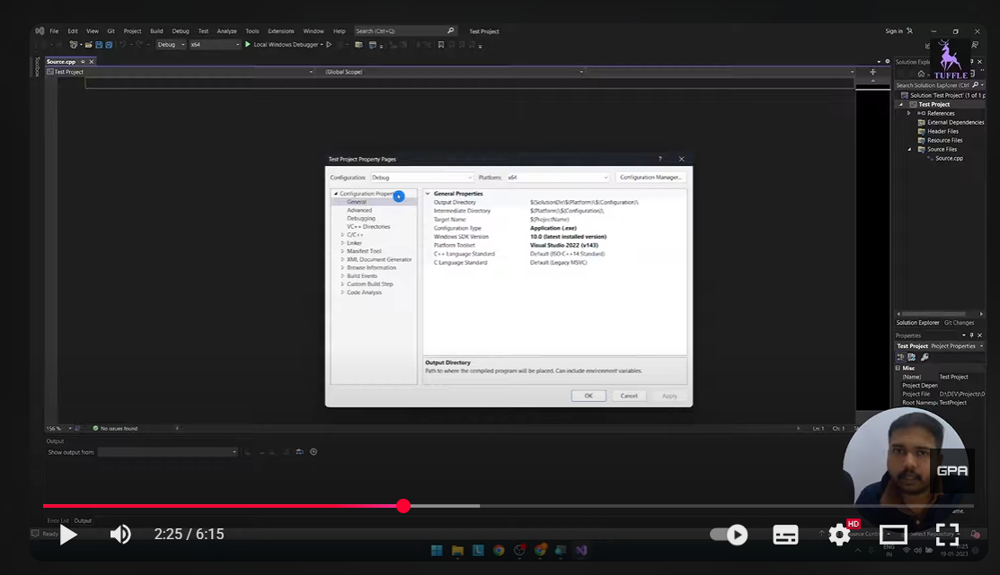

# Electronic Circuit Simulator

Welcome to the documentation for the **Electronic Circuit Simulator**, a simple SFML-based project that visualizes the behavior of basic electronic and physics concepts such as resistance, current, and power using real-time rendering.

---

## ⚙️ Setting Up the Project (Visual Studio + SFML)

Follow these steps to build and run the simulator on **Windows**:

1. Install **Visual Studio 2022** (with C++ Desktop Development tools).  
2. Download and install **SFML 2.6+**.  
3. In your Visual Studio project:
   - Add SFML include and library paths (`Include` and `Lib` folders).
   - Link the required SFML libraries:  
     `sfml-graphics`, `sfml-window`, `sfml-system`.
4. Copy the SFML `bin` DLLs to your project’s executable directory.
5. Build and run the project.

For a visual setup guide, watch this tutorial:  

---

## 💡 What is SFML?

**SFML (Simple and Fast Multimedia Library)** is a C++ library for graphics, audio, and input handling.  
It allows developers to easily create 2D visualizations, games, and interactive tools.

This project uses SFML to render electronic circuit diagrams and visualize the current and voltage distribution dynamically.

---

## 🧩 Project Idea and Code Overview

The project demonstrates how basic electrical circuits — especially **series-parallel resistor networks** — can be visualized dynamically using C++ and SFML.

### Core Functionality
- The user enters resistor values and configuration (series and parallel).
- The program calculates:
  - Equivalent resistance  
  - Total current and voltage  
  - Individual resistor current, voltage drop, and power
- Results are displayed in both text and graphical form.

### Main Components
- **main.cpp:** Handles input/output, performs calculations, and launches visualization.  
- **resources.h / resources.cpp:** Handle data storage, calculations, and all SFML rendering logic.

> 🧠 *The visualization window shows resistor groups as nodes and connections, with interactive data overlays.*

---

## 🧪 Demo Implementation

Here’s a video of the running simulator:

🎥 [Watch the Demo Video](assets/vid1.mp4)

This demo shows the real-time rendering of resistor nodes and circuit data as entered by the user.

---

## 🚀 Running the Executable

1. Download the **ZIP** file (same name as repository) from the project’s main directory.  
2. Extract it into any folder.  
3. Run the exe file:

*(Currently supports Windows only.)*

No installation or configuration needed — everything is self-contained.

---

## 📘 Concepts Learned & Future Scope

### Concepts Learned
- Working with **SFML graphics** and event handling  
- Structuring **C++ OOP code** for simulation logic  
- Implementing real-time **data visualization** and physics-based computation  
- Handling user input and file I/O efficiently  

### Future Scope
- 🧱 Improved and interactive UI  
- 🐧 Cross-platform builds (Linux / macOS)  
- ⚡ Support for more complex circuits (capacitors, inductors, voltage sources)  
- 🧮 Integration with a physics engine or symbolic solver  
- 💾 Option to save and load user-created circuit layouts  

---

## 🧭 Credits

Developed by **Once-1296**  
Licensed under the [MIT License](../LICENSE.md)

---

*This documentation site is built with [MkDocs Material](https://squidfunk.github.io/mkdocs-material/), featuring dark/light mode, navigation sidebar, and full-text search.*
